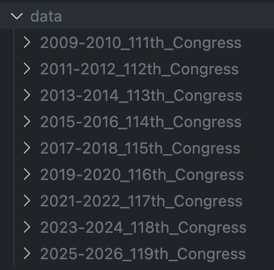

# Modelling-Congress

Modelling the path of bills through congress, which actions on a bill are likely to come after which others.

See

Explore for yourself:
https://modellingcongress-hidden-breeze-6910.fly.dev/

# Instructions

If you'd like to build the model youself:

1. Download the dataset from each congress term, and unzip them all into the data folder, like so:
   
2. Run run.py with argument --preprocessing_dir to the preprocessing directory that you'd like. Likely, it will be something like outputs/preprocess
   xs
